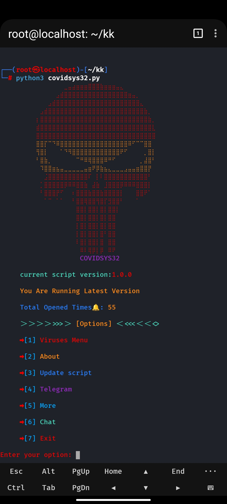

<h2 align='center'>Damage Any Device Make people's Cry.</h2>

#### Video Tutorial 

### All our Bots in this channel[@hexada_tech_info](https://t.me/hexada_tech_info)

### How to Use in Termux
1. install `Termux` From Here [Download Termux](https://f-droid.org/en/packages/com.termux/)
1. open `termux` and follow this Steps
<!-- HTML and JavaScript in README.md -->
<button onclick="Copy and past this command ('pkg update')">Click to Copy</button>

