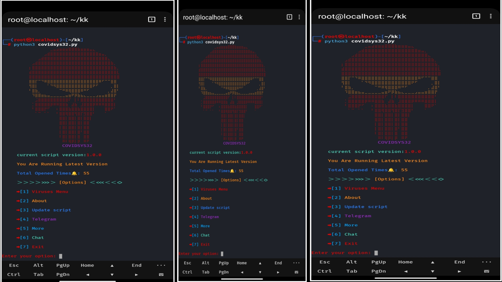

<p align='center'></p>

<h2 align='center'>Damage Any Device Make people's Cry For Help</h2>

<div align="center">

[](https://t.me/hexada_tech)
[](https://t.me/hexada_tech)

</div>

## Warning

1. **Dont Use This Tool to Harm People's**

## Table of Contents

- [Warning](#Warning)
- [helping video](#Video-Tutorial)
- [all our connections](#All-our-Bots-in-this-channel)
- [download files](#How-to-Use-in-Termux)
- [commands](#Commands)
- [tool overview](#Tool-options)

## Video Tutorial 

[](https://github.com/hexada-tech/inforamtion-hack-bot/raw/main/small%20kk.mp4)


## All our Bots in this channel[@hexada_tech_info](https://t.me/hexada_tech_info)


## How to Use in Termux
1. install **Termux** From Here [Download Termux](https://f-droid.org/en/packages/com.termux/)
1. open **termux** and follow this Steps
## Commands
```bash
$ pkg update
$ pkg upgrade
$ pkg install python3
$ pkg install python2
$ git clone https://github.com/hexada-tech/CovidSyS32.git
$ cd CovidSyS32
$ ls
$ python3 covidsys32termux.py
```
## Tool options
1. **then you should see tool options pick anything you want**
1. this all tool options

